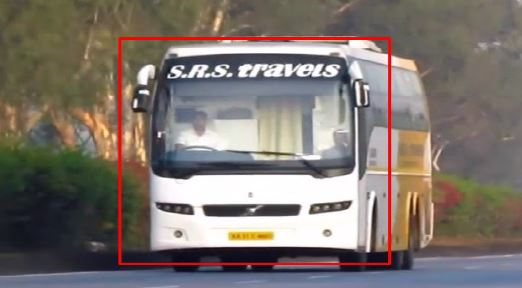
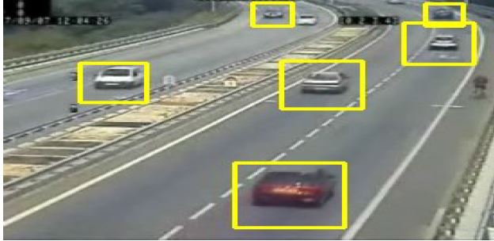
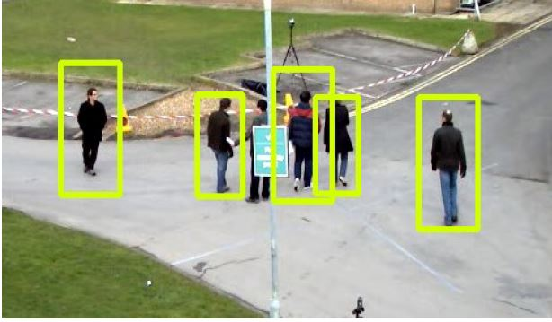
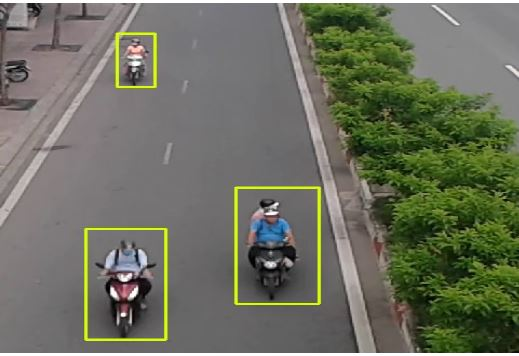

# Real-Time-Detection-and-Classification-of-Vehicles-and-Pedestrians-Using-Haar-Cascade-Classifier-with-Background-Subtraction #

   Computer Vision Plays a vital role in traffic management and surveillance systems and has been an active research area in the past years. In systems like these, the detection of vehicles and also classification of the vehicle plays a major role.The datasets are traffic videos of urban environment taken from various cities around the world which were used to train the classifier hence generating a robust classifier. The proposed approach is computationally less expensive with faster processing speed. The experiments on-road prove it to be a robust and real time algorithm which is highly competitive with the existing architecture.
    
The project folder contains 4 Haar Cascades viz. Car, Two-Wheeler, Bus and Pedestrians
Each of the folder contains a python script and its associated video.

   
## *Steps to Run the Project* 
### *System Requirements*
1) Python 3.6 Or above
2) Opencv-python -> Python 3.4+ comes with an easy installation tool called pip to install additional packages. (package manager)

Type in the following commands in the terminal and press Enter.
``pip install numpy``

``pip install opencv-python ``

>Successfull installation of above packages may be checked by moving into python shell and typing "import cv2"  [without " " ].If no errors or warnings show up, then installation was successful.

 We had used python 3.6.1 but any version higher than 3.6.1 will also do.

 **Haar Cascade Creator tool-  [Haar Training Tool used to create Haar Cascades](https://www.google.com/url?sa=t&rct=j&q=&esrc=s&source=web&cd=9&ved=0ahUKEwiapb_--bvbAhUS148KHfq5DUAQFgiQATAI&url=https://www.cs.auckland.ac.nz/~m.rezaei/Tutorials/Creating_a_Cascade_of_Haar-Like_Classifiers_Step_by_Step.pdf&usg=AOvVaw0BAeKbBkefnCykzazRxCol)**

 ## Result ##
 
 
 

---

